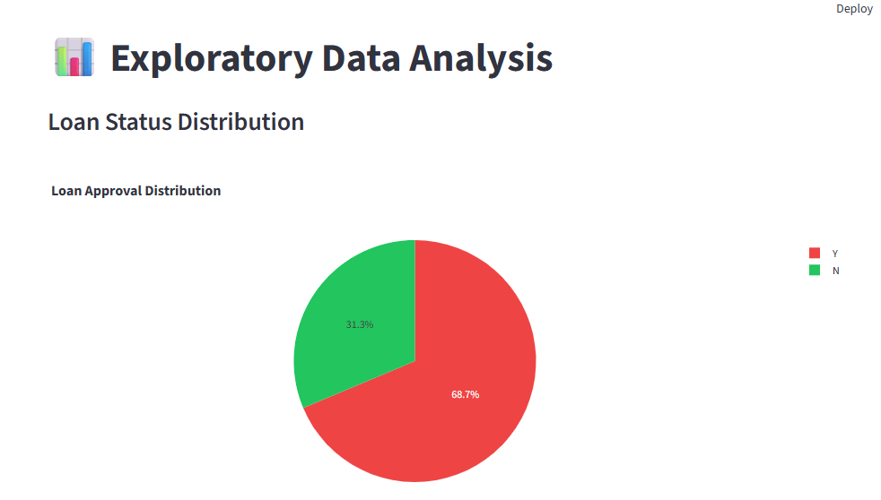

#  Smart Loan Approval Prediction System

##  Project Overview

The **Smart Loan Approval Prediction System** is a Machine Learning web application that predicts whether a loan application will be approved or rejected based on customer details.

The project performs:

* Data Preprocessing
* Feature Engineering
* Model Training
* Accuracy Evaluation
* Loan Prediction
* Interactive Dashboard

The application is developed using **Python, Pandas, NumPy, Scikit-Learn, Matplotlib and Streamlit**.

---

## 🚀 Features

* Interactive Streamlit Dashboard
* Loan Approval Prediction
* Data Visualization
* Missing Value Analysis
* Multiple ML Models
* Accuracy Comparison
* Download Prediction Report
* Responsive User Interface

---

## 📊 Dataset

Dataset Used:

Loan Prediction Dataset (Kaggle)

Columns:

* Gender
* Married
* Dependents
* Education
* Self Employed
* Applicant Income
* Coapplicant Income
* Loan Amount
* Loan Amount Term
* Credit History
* Property Area
* Loan Status

---

## 🤖 Machine Learning Models

The following algorithms were trained:

* Logistic Regression
* Decision Tree
* Random Forest
* K-Nearest Neighbors

---


## ▶️ Installation

Clone the repository

```
git clone https://github.com/yourusername/Loan_Prediction.git
```

Install dependencies

```
pip install -r requirements.txt
```

Train the model

```
python train_model.py
```

Run the Streamlit app

```
streamlit run app.py
```

---

## 📈 Workflow

```
Dataset
      │
      ▼
Data Cleaning
      │
      ▼
Feature Engineering
      │
      ▼
Model Training
      │
      ▼
Model Evaluation
      │
      ▼
Model Saving
      │
      ▼
Streamlit Dashboard
      │
      ▼
Prediction
```

---
## Analysis




This project is developed for educational purposes.
